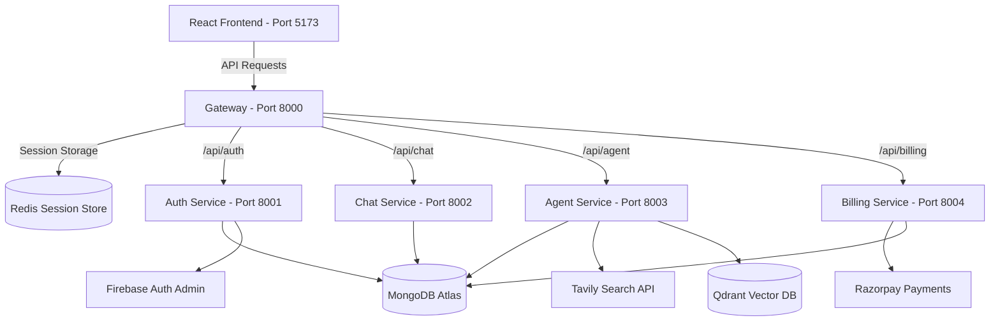

# 🧠 SyncAgents — The Ultimate Microservice AI Agent Playground! 🚀🤖

Welcome to **SyncAgents**! 🌟 This is a state-of-the-art, supercharged microservice platform engineered to host multiple AI agents with live coding previews, PPT/PDF generation, vision analysis, payment processing, and vector search capabilities. It is modular, lightning-fast, and powered by cutting-edge tools.

---

## 🏛️ System Architecture at a Glance 🗺️



---

## 🛠️ The Powerhouse Tech Stack ⚡🔋

Here are the technologies powering the SyncAgents ecosystem:

### 🌐 Frontend (The Face)
* **React 19:** Building smooth, interactive, and declarative UI components. ⚛️
* **Vite:** High-performance tooling with instant Hot Module Replacement (HMR). ⚡
* **Tailwind CSS v4:** Next-generation styling utility for modern, custom designs. 🎨
* **Monaco Editor (`@monaco-editor/react`):** Embedded developer editor in the browser for live code editing and agent previews. 💻
* **Framer Motion:** High-fidelity fluid micro-animations and page transitions. 🎬
* **Redux Toolkit (`@reduxjs/toolkit`):** Centralized global state management for chats, agents, and transactions. 📦
* **Firebase SDK:** Client-side authentication and session handlers. 🔑
* **React Router Dom v7:** Flexible routing architecture for SPA navigation. 🗺️

### ⚙️ Backend & Microservices (The Brains)
* **Node.js & Express.js:** Scalable async server runtime with ES Module support. 🟢
* **API Gateway:** Central entry point proxying requests using `express-http-proxy`, secured with `helmet` and logged with `morgan`. 🚥
* **Agent Service (Port 8003):** Multi-agent orchestrator utilizing:
  * **LangChain & LangGraph:** Orchestrates complex, stateful RAG and agent workflows. 🕸️
  * **DeepSeek, Google Gen AI (Gemini), & Groq:** Multi-model support for advanced reasoning, chat, and vision tasks. 🤖
  * **PDF & PowerPoint Generation:** Programmatically compiles documents using `pdfkit`, `pdf-parse`, and `pptxgenjs`. 📄📊
* **Auth Service (Port 8001):** Secure Firebase token validation and user identity management. 🛡️
* **Chat Service (Port 8002):** Manages agent conversations, message threads, and real-time interactions. 💬
* **Billing Service (Port 8004):** Handles user subscriptions, plans, and payments integrated with **Razorpay**. 💳
* **Shared Redis Modules:** A shared cache and session store powered by `ioredis` and shared local classes. 💾

### 🗄️ Databases & Infrastructure (The Memory)
* **MongoDB Atlas:** NoSQL cloud database storing user metadata, billing records, and agent memories. 🍃
* **Redis:** High-speed in-memory caching for session management and rate limiting. ⚡
* **Docker:** Containerized setup for running the local Redis container seamlessly. 🐳

---

## ✨ New & Advanced Features

* **Multi-Service Single Runner:** Start the entire project (all backend services + frontend) in one command using the new root scripts ([run-all.js](file:///C:/syncagents%20AI/run-all.js), [run-all.bat](file:///C:/syncagents%20AI/run-all.bat), or [run-all.ps1](file:///C:/syncagents%20AI/run-all.ps1)).
* **Monaco Editor Playground:** Edit code and scripts in real-time inside the browser client and test agent responses instantly.
* **Autonomous Document Generation:** AI agents can automatically draft PPT presentation slides and PDF files based on your prompts.
* **Unified API Routing:** All sub-services are reverse-proxied through the gateway on port `8000`, securing CORS headers, cookies, and authentication.
* **Razorpay Payment Gateway:** Fully functioning subscription plans with secure signature verification.

---

## 📂 Codebase Directory Layout 🗂️

```text
syncagents/
├── backend/
│   ├── gateway/                  # 🚦 API Gateway (Port 8000)
│   ├── shared/                   # 🤝 Shared libraries (Redis client, DB connections)
│   └── services/
│       ├── agent/                # 🤖 Agent Service (Port 8003) - LangChain & Docs
│       ├── auth/                 # 🔐 Auth Service (Port 8001) - User Sessions
│       ├── billing/              # 💳 Billing Service (Port 8004) - Razorpay Payments
│       └── chat/                 # 💬 Chat Service (Port 8002) - Conversation Store
│   ├── docker-compose.yml        # 🐳 Container orchestration for Redis
│   └── package.json              # 📦 Shared backend packages (dotenv, ioredis)
├── frontend/                     # 🎨 React 19 + Tailwind v4 + Monaco Editor SPA
├── run-all.js                    # ⚡ Unified cross-platform Node.js runner script
├── run-all.bat                   # ⚡ Windows batch runner script
└── run-all.ps1                   # ⚡ Windows PowerShell runner script
```

---

## 🔐 Environment Setup 🧬

To power up the environment locally, configure the following `.env` files:

### 1️⃣ Frontend (`frontend/.env`)
```env
VITE_FIREBASE_API=your_firebase_client_api_key
VITE_SERVER_URL=http://localhost:8000
```

### 2️⃣ Gateway (`backend/gateway/.env`)
```env
PORT=8000
REDIS_URL="redis://localhost:6379"
AUTH_SERVICE="http://localhost:8001"
CHAT_SERVICE="http://localhost:8002"
AGENT_SERVICE="http://localhost:8003"
BILLING_SERVICE="http://localhost:8004"
```

### 3️⃣ Auth Service (`backend/services/auth/.env`)
```env
PORT=8001
MONGODB_URL=your_mongodb_connection_string
```
> [!IMPORTANT]
> Make sure to drop your Firebase Admin Private Key JSON file at `backend/services/auth/serviceAccountKey.json`. 🔑

### 4️⃣ Agent Service (`backend/services/agent/.env`)
```env
PORT=8003
MONGODB_URL=your_mongodb_connection_string
REDIS_URL="redis://localhost:6379"
GEMINI_API_KEY=your_gemini_api_key
DEEPSEEK_API_KEY=your_deepseek_api_key
TAVILY_API_KEY=your_tavily_search_api_key
```

### 5️⃣ Billing Service (`backend/services/billing/.env`)
```env
PORT=8004
MONGODB_URL=your_mongodb_connection_string
RAZORPAY_KEY_ID=your_razorpay_key_id
RAZORPAY_KEY_SECRET=your_razorpay_key_secret
```

---

## 🚀 Local Launch Guide 🏃‍♂️💨

### 🐳 Step 1: Start Redis
Launch the local Redis container in detached mode:
```bash
cd backend
docker compose up -d
```

### 🤝 Step 2: Install Base Shared Modules
Install root backend dependencies to support the shared folder context:
```bash
cd backend
npm install
```

### ⚡ Step 3: Run Everything Instantly
From the root folder, launch the entire application concurrently using your preferred terminal:

*   **Option A: Unified Terminal Logs (Highly Recommended)**
    ```bash
    node run-all.js
    ```
*   **Option B: Separate Command Prompt Windows**
    ```cmd
    .\run-all.bat
    ```
*   **Option C: PowerShell Separate Windows**
    ```powershell
    .\run-all.ps1
    ```

Once started, open your browser to **[http://localhost:5173](http://localhost:5173)** and start exploring! 🚀🌌
