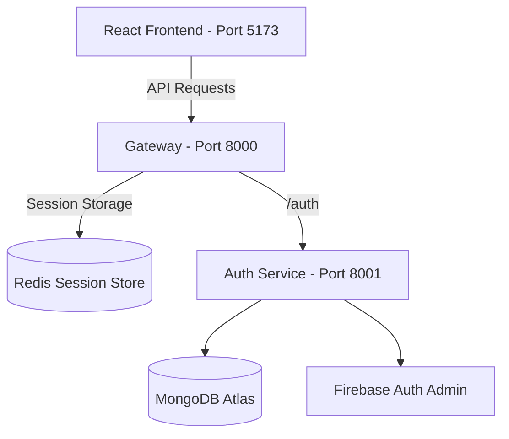

# 🧠 SyncAgents — The Ultimate Microservice AI Agent Playground! 🚀🤖

Welcome to **SyncAgents**! 🌟 This is a state-of-the-art, supercharged microservice platform engineered to host multiple AI agents with live coding previews, PPT/PDF generation, vision analysis, and vector search capabilities. It's modular, lightning-fast, and powered by modern tools. 😎🔥

---

## 🏛️ System Architecture at a Glance 🗺️



---

## 🛠️ The Powerhouse Tech Stack ⚡🔋

Here are the technologies powering this beast:

### 🌐 Frontend (The Face)


* **React 19:** Building smooth, interactive, declarative components. ⚛️
* **Vite:** Instantly fast builds and Hot Module Replacement (HMR). ⚡
* **Tailwind CSS v4:** Sleek, modern styling system for rich custom designs. 🎨
* **Firebase SDK:** User authentication and sign-in handlers. 🔑

---

### ⚙️ Backend & API Gateway (The Brains)


* **API Gateway:** Proxies and channels requests to sub-services on different ports. 🚥
* **Auth Service:** Dedicated microservice checking Firebase session tokens and talking to MongoDB. 🛡️
* **Shared Redis Modules:** Custom fast memory layers using `ioredis`. 💾

---

### 🗄️ Databases & Infrastructure (The Memory)


* **MongoDB Atlas:** Cloud database storing permanent user profiles and agent memory. 🍃
* **Redis:** In-memory store utilized for gateway caching and high-speed session tracking. ⚡
* **Docker:** Containerized setup for running the local Redis container seamlessly. 🐳

---

## 📂 Codebase Directory Layout 🗂️

```text
syncagents-ai/
├── backend/
│   ├── gateway/                  # 🚦 API Gateway (Port 8000)
│   ├── shared/                   # 🤝 Shared libraries & Redis client wrapper
│   ├── services/
│   │   ├── auth/                 # 🔐 Auth Service (Port 8001)
│   └── docker-compose.yml        # 🐳 Container orchestration for Redis
└── frontend/                     # 🎨 React + Vite UI client SPA (Port 5173)
```

---

## 🔐 Environment Setup 🧬

To power up the environment locally, configure the following `.env` files:

### 1️⃣ Frontend (`frontend/.env`)
```env
VITE_FIREBASE_API=your_firebase_client_api_key
VITE_SERVER_URL=http://localhost:8000
```

### 2️⃣ Gateway (`backend/gateway/.env`)
```env
PORT=8000
AUTH_SERVICE_URL=http://localhost:8001
FRONTEND_URL=http://localhost:5173
```

### 3️⃣ Auth Service (`backend/services/auth/.env`)
```env
PORT=8001
MONGODB_URL=your_mongodb_connection_string
```
> [!IMPORTANT]
> Make sure to drop your Firebase Admin Private Key JSON file at `backend/services/auth/serviceAccountKey.json`. 🔑

---

## 🚀 Speedrun: Local Launch Guide 🏃‍♂️💨

### 🐳 Step 1: Fire Up Redis
Start the Redis docker container in detached mode:
```bash
cd backend
docker compose up -d
```

### 🤝 Step 2: Set Up Shared Modules
Install dependencies for the shared Redis helpers:
```bash
cd backend/shared
npm install
```

### 🚦 Step 3: Start the Backend Engines
Open new terminals and run:

* **Gateway:**
  ```bash
  cd backend/gateway
  npm install
  npm run dev
  ```
* **Auth Service:**
  ```bash
  cd backend/services/auth
  npm install
  npm run dev
  ```

### 🎨 Step 4: Run the UI App
In a final terminal window, spin up the React dev server:
```bash
cd frontend
npm install
npm run dev
```
Open up your browser to **[http://localhost:5173](http://localhost:5173)** and start exploring! 🚀🌌
