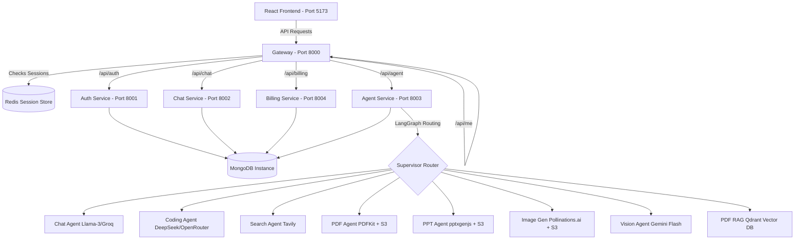

# SyncAgents Project Context

SyncAgents is a microservice-based AI agent platform that provides users with multiple AI capabilities: Conversational Chat, HTML/CSS/JS Coding & Live Previews (Artifacts), PDF Document Generation, PPT Slides Generation, Image Generation, Web Search, Vision Analysis, and PDF RAG (vector database similarity search).

---

## 📂 Codebase Directory Layout

```text
cortex-ai/
├── backend/
│   ├── gateway/                  # Express Gateway API (Port 8000)
│   ├── shared/                   # Shared modules (e.g. Redis client wrapper)
│   ├── services/
│   │   ├── auth/                 # Auth Service (Port 8001) - Firebase + MongoDB
│   │   ├── chat/                 # Chat Service (Port 8002) - Conversation & Message History
│   │   ├── agent/                # Agent Service (Port 8003) - LangGraph supervisor & AI agents
│   │   └── billing/              # Billing Service (Port 8004) - Razorpay subscription & credits
│   └── docker-compose.yml        # Setup for local Redis container
└── frontend/                     # React + Vite + Tailwind CSS + Redux Toolkit SPA
```

---

## 🏛️ Architecture Overview



---

## 🔐 Environment Variables Configuration

### 1. Frontend (`frontend/.env`)
```env
VITE_FIREBASE_API_KEY=your_firebase_api_key
VITE_SERVER_URL=http://localhost:8000
VITE_RAZORPAY_KEY=your_razorpay_key_id
```

### 2. Gateway (`backend/gateway/.env`)
```env
PORT=8000
REDIS_URL=redis://localhost:6379
AUTH_SERVICE=http://localhost:8001
CHAT_SERVICE=http://localhost:8002
AGENT_SERVICE=http://localhost:8003
BILLING_SERVICE=http://localhost:8004
```

### 3. Auth Service (`backend/services/auth/.env`)
```env
PORT=8001
MONGODB_URL=your_mongodb_url
FRONTEND_URL=http://localhost:5173
```
*Note: Make sure to paste your Firebase Admin service account key JSON inside `backend/services/auth/serviceAccount.json`.*

### 4. Chat Service (`backend/services/chat/.env`)
```env
PORT=8002
MONGODB_URL=your_mongodb_url
```

### 5. Agent Service (`backend/services/agent/.env`)
```env
PORT=8003
MONGODB_URL=your_mongodb_url
GOOGLE_API_KEY=your_google_gemini_api_key
CHAT_SERVICE=http://localhost:8002
AUTH_SERVICE=http://localhost:8001
GROQ_API_KEY=your_groq_api_key
TAVILY_API_KEY=your_tavily_api_key
GATEWAY_URL=http://localhost:8000
AWS_ACCESS_KEY_ID=your_aws_access_key_id
AWS_SECRET_ACCESS_KEY=your_aws_secret_access_key
AWS_REGION=ap-south-1
AWS_BUCKET_NAME=your_aws_s3_bucket_name
OPENROUTER_API_KEY=your_openrouter_api_key
QDRANT_URL=your_qdrant_db_url
QDRANT_API_KEY=your_qdrant_api_key
```

### 6. Billing Service (`backend/services/billing/.env`)
```env
PORT=8004
MONGODB_URL=your_mongodb_url
AUTH_SERVICE=http://localhost:8001
RAZORPAY_KEY_ID=your_razorpay_key_id
RAZORPAY_KEY_SECRET=your_razorpay_key_secret
```

---

## 🛠️ Step-by-Step Running Guide

### Step 1: Spin Up Redis
Start the Redis server using the provided `docker-compose.yml`:
```bash
cd backend
docker-compose up -d
```

### Step 2: Install and Start Backend Services
For each directory, install dependencies and run:
1. **Gateway**:
   ```bash
   cd backend/gateway
   npm install
   npm run dev
   ```
2. **Auth Service**:
   ```bash
   cd backend/services/auth
   npm install
   npm run dev
   ```
3. **Chat Service**:
   ```bash
   cd backend/services/chat
   npm install
   npm run dev
   ```
4. **Agent Service**:
   ```bash
   cd backend/services/agent
   npm install
   npm run dev
   ```
5. **Billing Service**:
   ```bash
   cd backend/services/billing
   npm install
   npm run dev
   ```

### Step 3: Install and Start Frontend
```bash
cd frontend
npm install
npm run dev
```
The frontend will start on [http://localhost:5173](http://localhost:5173).
